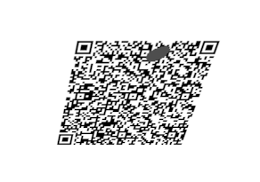
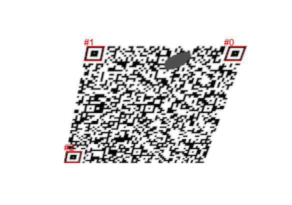

rqrr debugging tools
====================

`draw_rects.py` draws rectangles into the image based on rqrr debug output,
requires my fork `https://github.com/Safari77/rqrr` cloned to `../rqrr` .

## error3_persp.png

```
cargo build --release
./target/release/rqrtest error3_persp.png 2>&1 | python draw_rects.py \
    --input error3_persp.png  --output error3_persp_boxes.png
```

## error3_persp_boxes.png


